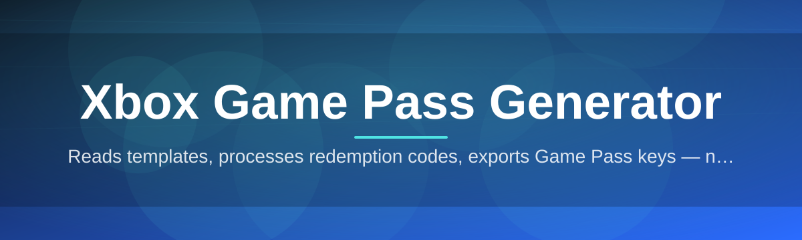

# xbox-game-pass-manager

Reads templates, processes redemption codes, exports Game Pass keys — no setup

  

## Overview

Reads templates, processes redemption codes, exports Game Pass keys — no setup

## License

[MIT License](LICENSE)
